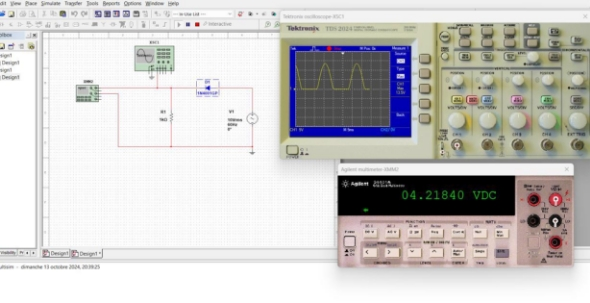
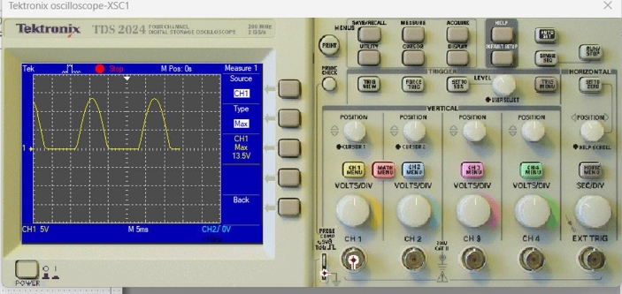
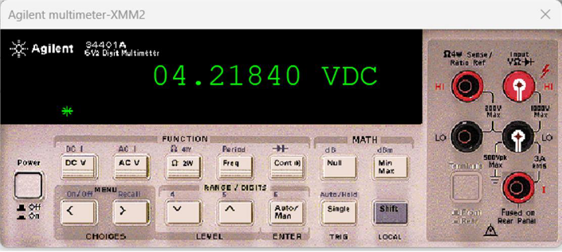
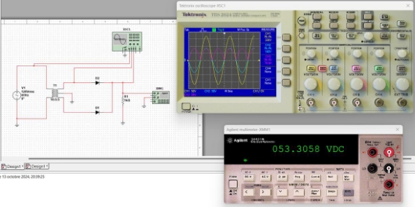
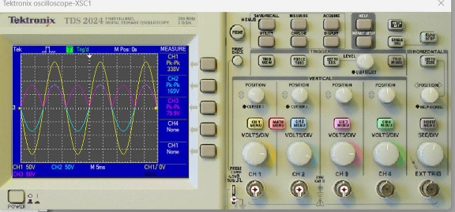
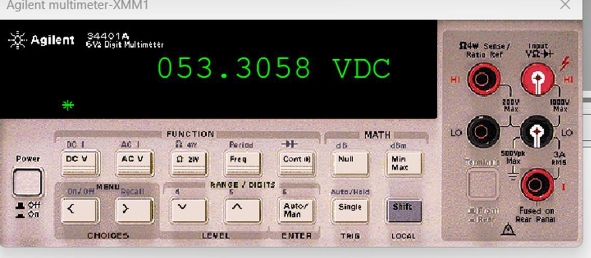
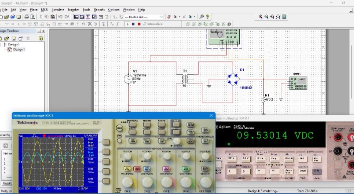
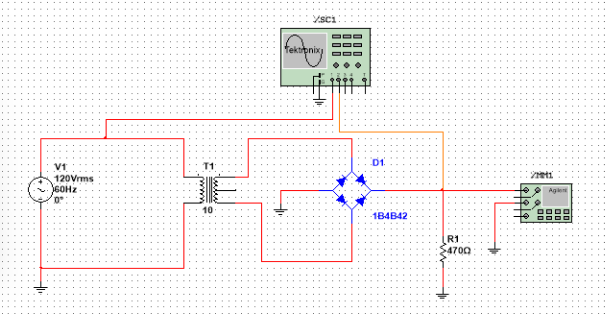
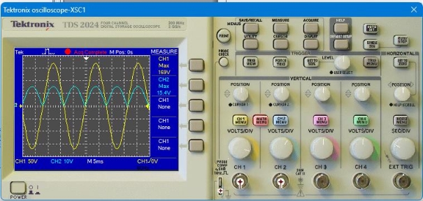
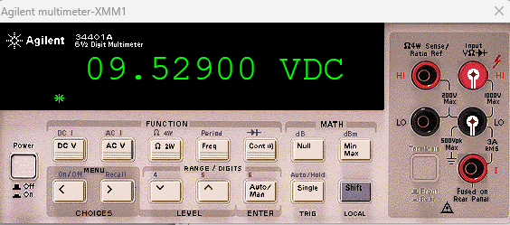



**Simulation 1 **

1. **Calcul des valeurs théoriques :** 
- Tension crête Vcrête : 

On a :      Veff = 10 

Alors :     =  × √2 = 10  × 1,414  = 14,14  

- Tension continue sur la charge V(DC) : 

Dans le circuit, il y a une diode D1 qui redresse le signal AC. En supposant une diode idéale et en négligeant toute chute de tension à ses bornes, la tension continue peut-être approximée par : 

1

- ×  = 14,14  × 0,318  ≈ 4,49   

Cependant, en pratique, une diode classique présente une chute de tension d’environ 0.7V. Donc, une valeur plus précise de la tension continue serait : 

1

- (  − 0,7 ) ×  = ( 14,14 − 0,7) × 0,318 ≈ 4,26  

π

2. **Comparaison avec les valeurs mesurées sur l'oscilloscope et le multimètre :** 
- D'après l'oscilloscope, la tension crête est d'environ 13.5 V 
- Le multimètre affiche une tension continue de 4.2179V. 

**Comparaison :** 

- Tension crête : La valeur théorique de la tension crête (14.14V) est proche de celle observée sur l'oscilloscope (13.5V), avec une légère différence probablement due aux pertes pratiques (chute de tension dans la diode et autres résistances dans le circuit). 
- Tension continue : La valeur théorique de la tension continue (4.26V) correspond également bien à la valeur mesurée par le multimètre (4.2179V), avec une petite différence liée aux effets réels du circuit. 

**Simulation 2** 

1. **Calcul des valeurs théoriques :** 
1. Tension crête Vcrête : 

On a :      Veff = 120 

Alors :     =  × √2 = 169.7 

3. Tension continue sur la charge V(DC) : 

1

- ×  = 53.8 

**2.Comparaison avec les valeurs mesurées sur l'oscilloscope et le multimètre :** 

- Le multimètre affiche une tension continue de 053.3058V. 

**Comparaison :** 

- Tension crête : La valeur théorique de la tension crête (169.7V) est proche de celle observée sur l'oscilloscope (169V), avec une légère différence probablement due aux pertes pratiques (chute de tension dans la diode et autres résistances dans le circuit). 
- Tension continue : La valeur théorique de la tension continue (53.8V) correspond également bien à la valeur mesurée par le multimètre (53.3058), avec une petite différence liée aux effets réels du circuit. 

  **Conclusion :** 

  Les deux valeurs sont très proches, avec une différence de 0.4942 V, soit environ 0.92%. Cette légère différence peut être due aux pertes dans le circuit ou à la précision de la simulation et des composants utilisés (diodes, transformateur, etc.). 

**Simulation 3 **

1. **Partie expérimentale :** 
1) **Circuit** 

2) **Oscilloscope** 

3) **Multimètre** 

2. **Partie Théorique** 
1) **Les valeurs crêtes de la tension d’entrée et de la tension de sortie** 

On sait que :  Crete = rms × √2 Application Numérique :  

CreteEntrée = 120 × √2 = 169.705  CreteSortie = CreteEntrée − 1.4 = 15.570  

11

Par Suite 

= 2 × CreteSortie 

Crete = 9.910 

2) **Comparaison les valeurs trouvées avec les valeurs mesurées.** 
- Tension crête : La valeur théorique de la tension crête « 169.705 V » est proche de celle observée sur l'oscilloscope « 169.000 V ». 
- Tension crête : La valeur théorique de la tension crête « 15.570 V » est proche de celle observée sur l'oscilloscope « 15.400 V ». 
- Tension continue : La valeur théorique de la tension continue 
- 9.910V » est proche à la valeur mesurée par le multimètre 
- 9.529V » 

**Conclusion :**  

Les écarts observés entre les valeurs théoriques et mesurées sont faibles, ce qui valide les hypothèses théoriques et montre que le montage et les instruments utilisés sont fiables. 

